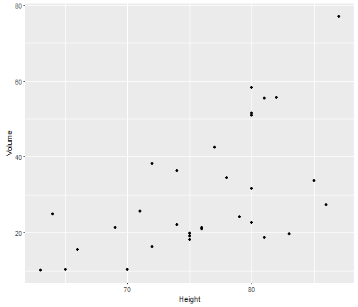

## Content

1. Dataset

2. Interactive Plot

3. Thanks

---

## Dataset

The used dataset is in the datasets package in R. It provides measurements of 3 characteristics of 31 felled black cherry trees.The characteristics are:
- Girth (inch)
- Height (ft)
- Volume (ft)

---

## Example of a possible Plot


```r
library(ggplot2)
library(datasets)
qplot(Height, Volume, data=trees)
```



---

## Thank you for reviewing my app

I hope you enjoyed this. 

Please do not hesitate to give any feedback.

Thank you for your time
